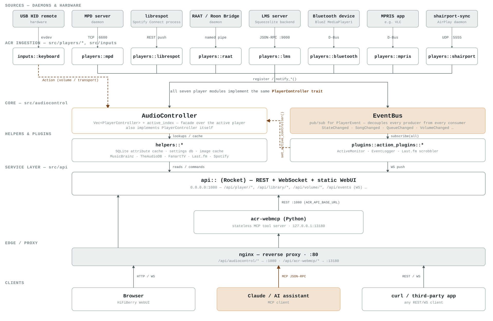
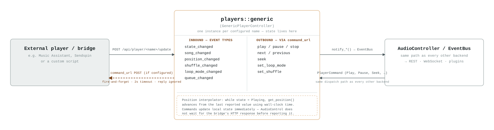

# Architecture

This document gives a system-level overview of AudioControl (ACR): what it is, how its
pieces fit together, and how a few concrete events flow through it. For per-subsystem
detail, see the other documents in this directory (linked from [README.md](README.md)).

## What it is

AudioControl is the successor to `audiocontrol2`, HiFiBerry's original Python control
daemon. The rewrite trades dynamic typing for a trait-based architecture: every audio
backend implements one `PlayerController` trait, every state change flows through one
typed event bus, and the plugin system is a small, statically-checked set of
`ActionPlugin`s.

In the wider HiFiBerry OS stack, ACR sits directly on top of PipeWire (which arbitrates
the sound card) and directly under the WebUI, which it serves itself. Audio players ship
as independent Debian packages; ACR is what makes them look like a single, switchable
device to the WebUI and to any external controller. A `generic` backend accepts the same
push API used internally, so a third-party player can register and report state without
a Rust code change.

## System overview

Nine source types feed player-backend modules behind a common trait. The
`AudioController` owns which one is "active" while the `EventBus` fans state changes out
to plugins and API clients. `acr-webmcp` is a separate Python process that turns the
REST API into MCP tools for AI assistants; nginx fronts both for LAN/WAN access.

Reading it top to bottom: each source feeds its matching ingestion module in
`src/players/*` (or `src/inputs` for the USB remote). All eight player modules
(everything except the keyboard input) implement the same `PlayerController` trait and
register with the `AudioController`, which tracks which one is currently active, and
publish events onto the `EventBus`. The `ActiveMonitor` plugin listens to that bus and
switches the active player automatically — there is no manual "switch source" step. The
Rocket API layer serves REST, WebSocket, and the static WebUI on port 1080;
`acr-webmcp` calls that same REST API to expose MCP tools on port 13180; nginx proxies
both on port 80.

The diagram shows the player daemon. The metadata half runs beside it as a
second daemon on port 1084 and does not appear there — see
[The two halves talk over loopback, one way](#the-two-halves-talk-over-loopback-one-way)
below.

The eighth player module, `players::generic`, is different from the other seven: it has
no daemon of its own. It is a two-way bridge that any external player can drive over
plain REST — see [Generic backend interface](#generic-backend-interface) below.

### The two halves talk over loopback, one way

**AudioControl is two daemons.** The *player* half (`src/`) is `audiocontrol`,
on port 1080: player backends, the library, the event bus, the REST and
WebSocket API, and the WebUI. The *metadata* half
(`crates/audiocontrol-metadata`) is `audiocontrol-metadata`, on port 1084:
MusicBrainz, TheAudioDB, FanArt.tv, Last.fm, cover art and the artist store.
Everything that crosses between them is an HTTP request to `127.0.0.1:1080`,
the port the player daemon listens on.

**Every connection is opened by the metadata daemon.** The player daemon holds
no address for it, no client for it and no configuration section naming it:
there is no `services.metadata`, and `scripts/check-crate-deps.sh` fails the
build if one reappears or an address is hard-coded. Data still travels both
ways; what is one-way is who calls whom, and that is what let the metadata half
move into a process of its own without the player half learning where it went.
It is also why only one of the two has to be listening for the other, and why
the player daemon needs no configuration change at all to run beside it.

| Connection | Carries | How it travels |
|---|---|---|
| The event subscription | song, state and library changes, downward | the metadata daemon subscribes to the player daemon's WebSocket at `ws://127.0.0.1:1080/api/events` |
| The library reads | lists to enrich | `GET /api/library`, `/library/
`, `/artists`, `/albums`. What tells it to look is the `library_changed` event above, plus a slow backstop sweep |
| The result writes | lookups, upward | `POST /api/player/<name>/song-information`, `POST /api/library/
/enrichment` |
| The Spotify token | a bearer token for Spotify search | `GET /api/spotify/access_token` — the player daemon owns the account, so playback control needs no HTTP at all |

`CoreClient` (`crates/audiocontrol-metadata/src/core_client.rs`) is the one
client, pointed at `services.core.url` in `metadata.json` — which must be
written out explicitly, because a value derived from the top-level `webserver`
section would give the metadata daemon its own port. The player side's
`MetadataClient` is deleted: its last two calls answered the player half's own
artist routes, and both are gone — the biography and banner travel in the
enrichment batch, and `/api/library/
/image/artist:<name>` answers 302 to
`/api/coverart/artist/<b64>/image` rather than fetching it. **Playback control,
and every other player route, therefore works with the metadata daemon
stopped** — verified on hardware, and asserted by the integration suite.

**The two daemons are still not a deployment choice a device makes.** They ship
in one package, as two binaries and two units, both enabled; they install,
upgrade and roll back together. Nothing here is separately installable,
separately versioned or optional, and no device runs one half at a different
version from the other. What a user sees of the split is a second name in
`systemctl` and nothing else.

The player daemon in the package is built `--no-default-features --features
alsa`, so it carries no metadata code at all rather than merely not calling it.
Built with the default features it brings up a whole metadata instance of its
own — a second artist store, a second settings database, a second enricher and
a second scrobbler on the same events.

[**How the parts communicate**](communications.md) is the detail behind this
section: every seam with its routes, payloads, timeouts and failure behaviour,
sequence diagrams for each, the two library tokens and how they differ, a
failure matrix, and the measured cost of the seam. Read it before changing
anything that crosses it.

Two consequences worth knowing when reading the code. First, a failure across a
seam is a *network* failure with a timeout, not a `None` return — every caller
has a documented fallback, listed in the module docs of the client above.
Second, start-up has two stages in the metadata daemon:
`audiocontrol_metadata::initialize_in_process` brings up the providers and
opens the stores, while
`audiocontrol_metadata::startup::start_after_core_is_listening` starts the
WebSocket subscriber and the library puller only after probing
`GET /api/version` on the player daemon — for up to 30 s, and then starting
them anyway. The unit has `After=audiocontrol.service` but deliberately no
`Requires=`: neither daemon can stop the other.

## Core abstractions

| Abstraction | Location | Role |
|---|---|---|
| `PlayerController` | `src/players/player_controller.rs` | One trait every backend implements: `get_song`, `get_playback_state`, `send_command`, `get_capabilities`. A shared `BaseController` supplies the `notify_*` helpers that publish to the EventBus, so backends never touch it directly. |
| `AudioController` | `src/audiocontrol/audiocontrol.rs` | Holds every registered controller in a `Vec` plus one `active_index`, and itself implements `PlayerController` by delegating to whichever entry is active — a composite that lets API code treat "the system" as one player. |
| `EventBus` | `src/audiocontrol/eventbus.rs` | Typed pub/sub for `PlayerEvent` (state, song, queue, volume, capabilities…). Every player, plugin, and the WebSocket layer subscribe independently — nothing polls anything else inside the process. |
| `ActionPlugin` | `src/plugins/action_plugin.rs` | Subscribes to the bus and reacts. `ActiveMonitor` is the one that matters most: any player that starts *Playing* automatically becomes the active player. |

## Player backends

Configured under `players` in `/etc/audiocontrol/audiocontrol.json`. "Push" backends are
notified when something changes; "poll" backends are asked.

| Backend | Source | Mechanism | Address | Direction |
|---|---|---|---|---|
| `mpd` | MPD server | MPD binary protocol | `localhost:6600` | poll |
| `librespot` | librespot process | process watch + `--onevent` hook → REST | `POST /player/librespot/update` | push |
| `raat` | Roon Bridge | named pipes | `/var/lib/raat/{metadata,control}_pipe` | push |
| `lms` | Lyrion/Logitech Media Server | JSON-RPC, autodiscovery | `:9000` | poll |
| `bluetooth` | paired BT device | D-Bus (BlueZ `MediaPlayer1`) | system bus | poll |
| `mpris` | any MPRIS2 app (e.g. VLC) | D-Bus, 1s poll | session bus | poll |
| `shairport` | shairport-sync | UDP metadata protocol, listened in-process | `:5555` | push |
| `generic` | any third-party player | same REST push API, by name | `POST /player/<name>/update` | push |

## Generic backend interface

`players::generic` (`GenericPlayerController`, `src/players/generic/generic_controller.rs`)
is the escape hatch for anything that isn't one of the seven named backends: it holds no
connection to a real daemon, just whatever state the last API call gave it. One instance
is created per configured player name, so several independent bridges (e.g. one per room)
can run at once.

Two flows run through it, independently and in opposite directions:

- **Inbound (state in).** The bridge `POST`s to `/api/player/<name>/update` with one of
  six event types: `state_changed`, `song_changed`, `position_changed`,
  `shuffle_changed`, `loop_mode_changed`, `queue_changed`. These update the controller's
  internal state and flow out through the normal `notify_*()` → `EventBus` path, exactly
  like any other backend. While the state is `Playing`, `get_position()` interpolates
  from the last reported position using wall-clock time, so the bridge does not need to
  push `position_changed` every second.
- **Outbound (commands out).** When `AudioController` dispatches a `PlayerCommand` to
  this controller — `Play`, `Pause`, `Stop`, `Next`, `Previous`, `Seek`,
  `SetLoopMode`, `SetRandom` — it updates its own state immediately, and *if* a
  `command_url` was configured for this player, also fires a `POST {"command": ...}` to
  that URL on a background thread with a 2-second timeout. The result is not
  awaited or checked: a slow or absent bridge cannot block playback control for
  everything else.

Full request/response shapes for both directions are in
[`src/players/generic/API.md`](../src/players/generic/API.md) and
[Generic Player Controller](generic_player_controller.md).

## Module map (`src/`)

| Module | Responsibility | Key files |
|---|---|---|
| `api/` | Rocket server and every REST/WebSocket route, grouped by domain (players, library, volume, coverart, lastfm, spotify, genres, settings…). | `server.rs`, `players.rs`, `events.rs`, `library.rs` |
| `audiocontrol/` | The engine: `AudioController` (player registry + active selection) and `EventBus` (pub/sub). **Nothing here talks to the metadata half**: `metadata_client.rs` is deleted, and `resolver.rs` is what replaced one of its calls — splitting an album-artist string on separators alone, corrected afterwards by the enrichment batch. `now_playing_bridge.rs` is the in-process forwarder that preceded the seam; the daemon no longer uses it — song and state changes reach the metadata side over the WebSocket, and results come back through `POST /api/player/<name>/song-information`. | `audiocontrol.rs`, `eventbus.rs`, `resolver.rs` |
| `players/` | `PlayerController` trait, shared `BaseController`, the eight backend implementations, a JSON-driven factory, and the generic push endpoint. `librespot/spotify_account.rs` holds the Spotify account — the OAuth flow, the tokens and their refresh — because playback control is what needs it and must work with the metadata half absent. | `player_controller.rs`, `player_factory.rs`, `event_api.rs`, `mpd/`, `librespot/`, `raat/`, `lms/`, `bluetooth/`, `mpris/`, `shairport/`, `generic/` |
| `data/` | Shared domain types passed between every layer: `Song`, `Track`, `PlayerCommand`, `PlayerEvent`, `PlaybackState`, capability sets. | `song.rs`, `player_command.rs`, `player_event.rs`, `capabilities.rs` |
| `helpers/` | Cross-cutting services that stay with the player daemon: volume control and its configurator client, lyrics, m3u parsing, the stream-title splitter, local cover art and image prewarm, and the systemd/MPRIS/Bluez/mac-address process helpers. The SQLite caches, the provider clients and the secret store moved out to the shared crates and `audiocontrol-metadata` — see the module map below. | `volume.rs`, `global_volume.rs`, `configurator.rs`, `lyrics.rs`, `songtitlesplitter.rs`, `local_coverart.rs`, `imageprewarm.rs` |
| `plugins/` | `ActionPlugin` trait plus the built-ins that react to bus events: active-player switching and structured event logging. Last.fm scrobbling is no longer one of them — the `lastfm` entry configures a worker in `audiocontrol-metadata`, and `worker_descriptor.rs` is what keeps that entry in `/api/plugins/actions`. | `action_plugin.rs`, `action_plugins/active_monitor.rs`, `event_logger.rs`, `worker_descriptor.rs` |
| `inputs/` | Hardware input, deliberately separate from streaming players: USB HID remotes turn into `Action`s and reach the controller through an `ActionSink`, so a new rotary or IR source needs no new dispatch code. | `mod.rs`, `keyboard/evdev_source.rs`, `dispatch.rs` |
| `tools/` | 10 standalone `acr_*` binaries — integration hooks, CLI clients, and diagnostics. Four more (`audiocontrol_dump_cache`, `audiocontrol_dump_store`, `audiocontrol_favourites`, `audiocontrol_musicbrainz_client`) build from `crates/audiocontrol-metadata/src/bin/` instead, since they use only metadata-crate code. See [CLI Tools](cli_tools.md). | `src/tools/*.rs` |

## Module map (`crates/`)

Shared code and the metadata daemon's library live in a Cargo workspace next to
`src/`. Six crates are owned by neither daemon; a seventh, `audiocontrol-metadata`,
is the metadata code the `audiocontrol` binary links behind its default `metadata`
feature. `scripts/check-crate-deps.sh` enforces that the `audiocontrol` *library*
never depends on `audiocontrol-metadata` — `src/main.rs` is the one file that
links both.

| Crate | Responsibility | Key files |
|---|---|---|
| `acr-types` | Plain domain types and pure functions shared by both daemons: `Song`, `Artist`, `Album`, `Track`, `Identifier`, the enrichment payload types, the interface traits (`LibraryEnricher`, `Resolver`, `SongInformationSink`, `PlaybackStateSource`), and string/URL helpers. No Rocket, no I/O. | `song.rs`, `artist.rs`, `enrichment.rs`, `resolver.rs`, `now_playing.rs`, `urlprefix.rs` |
| `acr-http` | The outbound HTTP plumbing both daemons use: the retrying client, the per-service rate limiter. | `http_client.rs`, `retry.rs`, `ratelimit.rs` |
| `acr-images` | Image resizing and format handling shared by every cache that serves `?size=` variants: rung snapping, `@<size>` naming, format sniffing, grading. | `imageresize.rs`, `sniff.rs`, `image_grader.rs` |
| `acr-store` | The persistent stores each daemon initialises over its own directory: the SQLite attribute cache and settings DB, the image cache and its retired-rung purge, background jobs, genre cleanup. | `attributecache.rs`, `settingsdb.rs`, `imagecache.rs`, `imagepurge.rs`, `backgroundjobs.rs` |
| `acr-web` | The Rocket pieces both APIs share: the `ForwardedPrefix` guard, image responses with ETag/304, path validation, and the `/imagecache/<path..>` route factory each daemon mounts over its own cache. | `imageresponse.rs`, `validated.rs`, `imagecache.rs`, `urlprefix.rs` |
| `acr-secrets` | Everything compiled-in or encrypted that neither daemon owns alone: the AES-GCM `SecurityStore` each daemon opens over its own file, and the `build.rs` that obfuscates `secrets.txt` into `secrets.rs`. The generator lives here because the player daemon needs the Spotify OAuth proxy URL and secret and cannot depend on `audiocontrol-metadata` to get them. | `security_store.rs`, `secrets.rs`, `build.rs` |
| `audiocontrol-metadata` | The metadata code: MusicBrainz/TheAudioDB/fanart.tv/Last.fm clients, a token-taking Spotify search client (the Spotify *account* is the player daemon's), cover-art providers, the artist store, the library enricher, its own Rocket routes, its clients of the player daemon (`core_client.rs`, `now_playing_ws.rs`, `library_puller.rs`), the two-stage start-up in `startup.rs`, the `audiocontrol-metadata` daemon's own composition root, and the four CLI tools that only need this crate's code. The daemon binary is here rather than in the root package so that building it does not require compiling the player library and its native dependencies (ALSA, D-Bus, MPD, evdev) first -- the two variants link identically, since rustc links no rlib a crate does not name, but only this one can be built where the player half cannot. | `musicbrainz.rs`, `lastfm.rs`, `spotify.rs`, `library_enricher.rs`, `core_client.rs`, `now_playing_ws.rs`, `library_puller.rs`, `startup.rs`, `api/`, `src/bin/audiocontrol-metadata.rs`, `src/bin/*.rs` |

## The acr-webmcp bridge

`acr-webmcp` is not part of the Rust binary — it's a separate, dependency-free Python
HTTP server (`packages/acr-webmcp/src/acr-webmcp`) that translates MCP tool calls into
REST calls against ACR's own API and hands the JSON straight back. It holds no state of
its own.

| Tool group | Examples |
|---|---|
| Playback | `players_list`, `now_playing`, `playback_command` |
| Queue | `player_queue`, `queue_add_track`, `queue_play_index` |
| Library | `library_albums`, `library_albums_by_artist`, `library_categories` |
| Genre config | `genre_mapping_set`, `genre_ignore_add`, `genre_config_get` |

Full tool list: `docs/acr-webmcp.md` (repository root). No authentication is required on
the local network.

## Data flow traces

### Spotify track change (event flowing outward)

1. librespot's `--onevent` hook runs `audiocontrol_notify_librespot` with
   `PLAYER_EVENT=track_changed`.
2. The tool `POST`s the new track as JSON to `/api/player/librespot/update`.
3. Rocket routes it to `players::event_api::player_event_update`, which finds the
   controller named `librespot` and calls `process_api_event()`.
4. `players::librespot` updates its song, then calls
   `BaseController::notify_song_changed()`.
5. `EventBus` publishes `PlayerEvent::SongChanged` to every subscriber.
6. `ActiveMonitor` makes librespot the active player; WebSocket clients get the new
   track.
7. One of those WebSocket clients is the metadata daemon, connected from the
   other process. Its subscriber turns the frame back into a `SongChanged` and
   hands it to the enrichment workers and the Last.fm scrobbler; anything they
   find comes back through `POST /api/player/librespot/song-information`. If
   that daemon is not running, steps 1 to 6 happen exactly as above and only
   this step is lost.

### "Pause the music" via Claude (command flowing inward)

1. Claude calls `playback_command` on `acr-webmcp` with
   `{player: "active", command: "pause"}`.
2. `acr-webmcp` `POST`s to `/api/player/active/command/pause` on ACR's REST API.
3. `send_command_to_player_by_name` resolves `"active"` via
   `AudioController::get_active_controller()` — say, `players::mpd`.
4. The string `"pause"` parses to `PlayerCommand::Pause` and is sent straight to that
   controller.
5. `players::mpd` issues MPD's own `pause` command over its TCP connection to the
   daemon.
6. MPD pauses; on its next status poll, `players::mpd` observes the change and
   publishes `StateChanged` back out.

## Deployment

One package, `hifiberry-audiocontrol`, installs both daemons. Both units are
enabled; they are upgraded and rolled back together.

| Component | Process | Address | Config / unit |
|---|---|---|---|
| Player daemon | `/usr/bin/audiocontrol` | `0.0.0.0:1080` | `audiocontrol.service` · `/etc/audiocontrol/audiocontrol.json` · runs as user `audiocontrol` |
| Metadata daemon | `/usr/bin/audiocontrol-metadata` | `127.0.0.1:1084` | `audiocontrol-metadata.service` · `/etc/audiocontrol/metadata.json` · same user · `After=audiocontrol.service`, no `Requires=` · logs to the journal, level from `RUST_LOG` or `--debug` |
| acr-webmcp | `/usr/bin/acr-webmcp` | `127.0.0.1:13180` | `acr-webmcp.service` (user unit) · `ACR_API_BASE_URL` env var |
| Reverse proxy | nginx | `:80` | `/api/audiocontrol/*` → :1080, with `coverart/`, `lastfm/`, `favourites/`, `audiodb/`, `artist/`, `resolve/` and `imagecache/external/` → :1084; `/api/metadata/*` → :1084; `/api/acr-webmcp/*` → :13180 |

Each daemon owns its own state, and nothing is shared by two writers.

| Path | Owner | Contents |
|---|---|---|
| `/etc/audiocontrol/audiocontrol.json` | player | Main config: `services`, `players`, `action_plugins`, `inputs`. |
| `/etc/audiocontrol/metadata.json` | metadata | Providers, its own stores, and `services.core.url` — the one address either daemon holds. |
| `/var/lib/audiocontrol/cache/attributes.db` | player | SQLite attribute cache. |
| `/var/lib/audiocontrol/cache/images` | player | Cached cover art and images. |
| `/var/lib/audiocontrol/db/settings.db` | player | SQLite settings database. |
| `/var/lib/audiocontrol/security_store.json` | player | AES-GCM credential store, managed by `SecurityStore`. Holds the Spotify tokens. |
| `/var/lib/audiocontrol/metadata/` | metadata | Its own `attributes.db`, `images/` and settings database. |
| `/var/lib/audiocontrol/metadata/security_store.json` | metadata | Its own credential store, holding `lastfm_session_key` and `lastfm_username`. |
| `/var/lib/audiocontrol/user/images` and `cache/artists` | metadata | Artist images. Deliberately left at their old paths rather than moved under `metadata/`, because the URLs clients already hold point into them — but only the artist store writes here, and that lives in the metadata daemon. |
| `/etc/hifiberry/auth.d/audiocontrol-auth.json`, `…-metadata-auth.json` | nginx | The auth manifests that tell `hifiberry-auth` which routes are permissive. Not secrets. |

**The two credential stores are separate because two processes cannot share
one.** `SecurityStore` writes its whole in-memory map over the file, truncating,
so two daemons that each loaded a copy would overwrite each other's keys.
`postinst` *copies* the existing store to the metadata daemon's path on
upgrade — it never moves it — so a rollback finds the player daemon's file
intact. Each store keeps the other's keys after the copy; they are inert.

## See also

- [API Documentation](api.md)
- [CLI Tools](cli_tools.md)
- [Generic Player Controller](generic_player_controller.md)
- [SystemD Integration](systemd_integration.md)
- `docs/acr-webmcp.md` (repository root)
