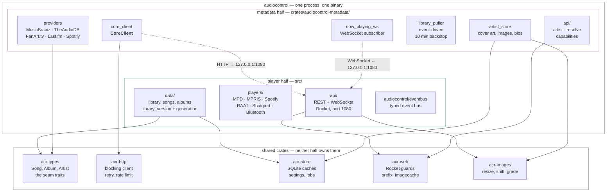
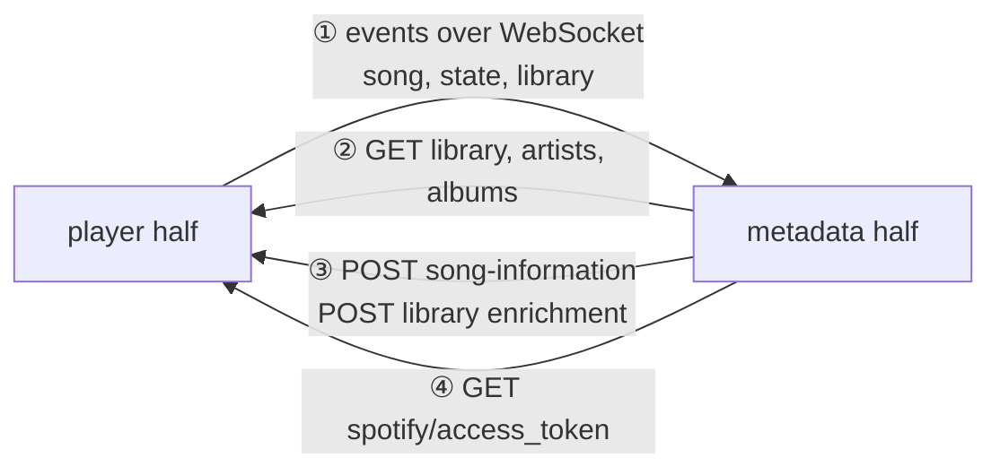
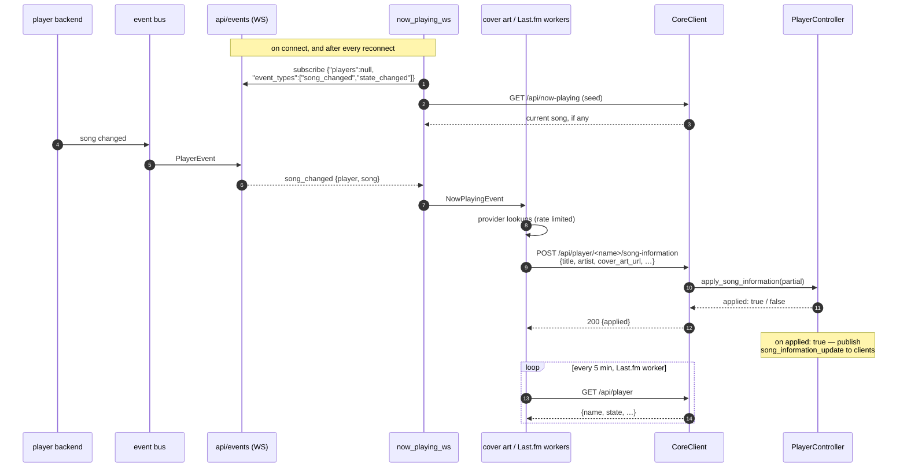
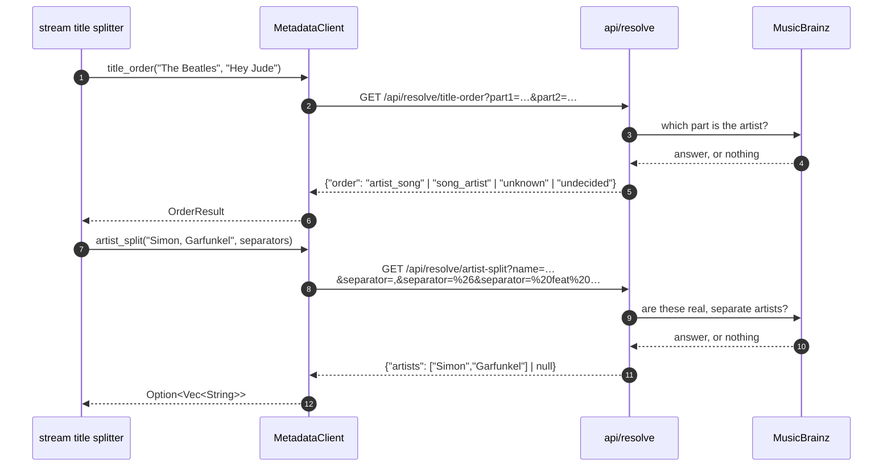
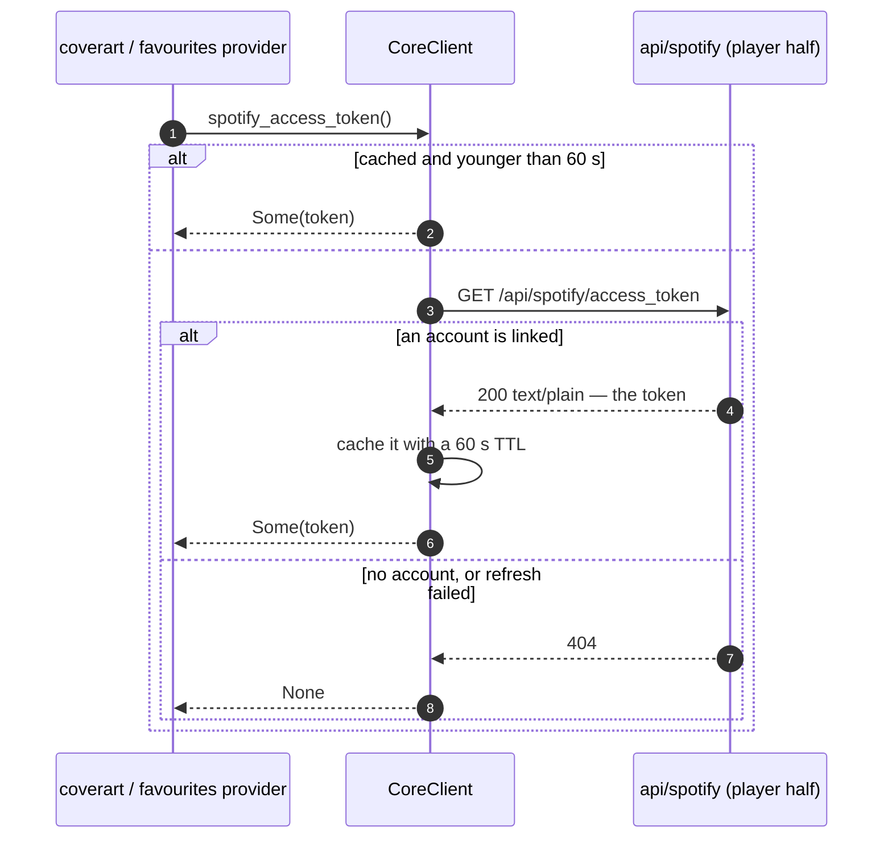
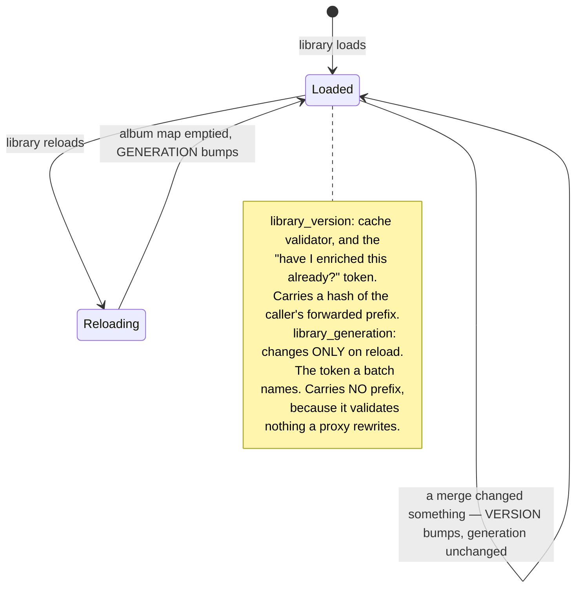
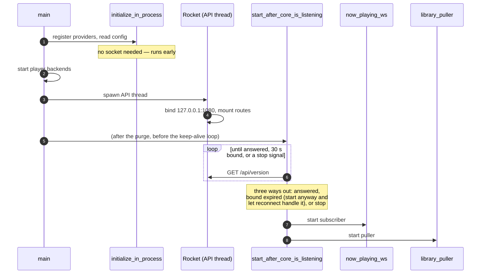

# How the parts communicate

AudioControl is one process with a seam down the middle. On one side is the
*player* half: player backends, the library, the event bus, the REST and
WebSocket API. On the other is the *metadata* half: MusicBrainz, TheAudioDB,
FanArt.tv, Last.fm, cover art and the artist store. Neither calls the other
directly. Everything that crosses between them is an HTTP request to
`127.0.0.1`, on the port this same process is listening on.

**The seam runs one way.** Every connection across it is opened by the metadata
half. The player half holds no address for the metadata half and no client for
it: there is no `services.metadata` section, and a violation would have to
hard-code an address, which `scripts/check-crate-deps.sh` looks for. Data still
travels both ways -- what is one-way is *who calls whom*, and that is the
property that means only one of the two needs to be listening for the other.

This document is the map of that seam: what the parts are, what each owns, and
exactly how each pair talks. It is written from the code. Where the design
document ([`specs/2026-09-04-player-metadata-split.md`](specs/2026-09-04-player-metadata-split.md))
and the code differ, the code is described here and the difference is called
out — that has happened five times, and each time the code had found the
better answer.

For the shorter version, see [architecture.md](architecture.md#the-two-halves-talk-over-loopback).
This file is the detail behind it.

---

## Contents

- [Why it is built this way](#why-it-is-built-this-way)
- [The parts](#the-parts)
- [The dependency rule, and how it is enforced](#the-dependency-rule-and-how-it-is-enforced)
- [The seams at a glance](#the-seams-at-a-glance)
- [Seam 1: now-playing enrichment](#seam-1-now-playing-enrichment)
- [Seam 2: library enrichment](#seam-2-library-enrichment)
- [Seam 3: the resolvers](#seam-3-the-resolvers--gone)
- [Seam 4: the Spotify access token](#seam-4-the-spotify-access-token)
- [Seam 5: favourites](#seam-5-favourites)
- [What the player half serves without asking](#what-the-player-half-serves-without-asking)
- [The two library tokens](#the-two-library-tokens)
- [Start-up and shutdown](#start-up-and-shutdown)
- [What clients see](#what-clients-see)
- [When something is missing or slow](#when-something-is-missing-or-slow)
- [What changes when the process splits](#what-changes-when-the-process-splits)
- [Where this map is thin](#where-this-map-is-thin)

---

## Why it is built this way

The two halves have almost nothing in common. The player half is driven by
events from hardware and local daemons; it must answer a keypress in
milliseconds and must never block on the network. The metadata half is almost
entirely network: rate-limited third-party APIs, retries, caches, image
downloads, OAuth tokens. Running them in one address space meant one crash, one
memory profile, one restart, and one set of credentials in a process that also
holds a socket open to the local network.

Splitting them into two processes is the goal. Doing it in one step would mean
inventing every interface and moving every file at once, with no working state
in between. So the seams were converted to HTTP *first*, while both halves still
share a process. Every call already crosses a network boundary with a timeout, a
serialised payload and a documented failure path — against the same routes a
separate daemon will serve. Moving the metadata half into its own process
becomes a packaging and configuration change rather than a redesign.

**The split is internal, and not a deployment choice a device makes.** One
binary today, two binaries in one package later; one systemd unit today, two
later. There is no installation that runs "just the player half", and no device
runs one half at a different version from the other.

---

## The parts



The dotted arrows are the only paths between the halves, and both start on the
metadata side. There is no arrow the other way and no box to draw one from:
`MetadataClient` used to sit in `src/audiocontrol/` and is gone.

| Part | Owns |
|---|---|
| `src/api/` | Every client-facing route and the WebSocket. Rocket, bound to port 1080. |
| `src/players/` | One module per backend. Each turns its source's notion of "what is playing" into the shared `Song` and `PlaybackState`. |
| `src/data/` | The in-memory library, and both library tokens. |
| `src/audiocontrol/` | The event bus, and the local decisions that replaced the seam calls the player half used to make. |
| `crates/audiocontrol-metadata/` | Every third-party provider, the artist store, the cover-art pipeline, the account credentials, and `CoreClient`. |
| `crates/acr-types/` | The data types both halves exchange, and the **traits that define the seams**. No I/O. |
| `crates/acr-http/` | The blocking HTTP client both halves use, with retry and per-host rate limiting. |
| `crates/acr-store/` | SQLite attribute cache, settings database, image cache, background-job registry. |
| `crates/acr-web/` | Rocket request guards and responders shared by both — the forwarded-prefix guard, the image responders, the image-cache routes. |
| `crates/acr-images/` | Resizing, variant naming, format sniffing, image grading. |

The traits in `acr-types` are the load-bearing part of this arrangement. Each
seam is a trait, and each trait has two implementations: an in-process one used
by tests, and an HTTP one used by the daemon. Neither half names the other's
type.

| Trait | Implemented over HTTP by | Lives in |
|---|---|---|
| `SongInformationSink` | `CoreClient` | metadata half |
| `PlaybackStateSource` | `CoreClient` | metadata half |
| `AccessTokenSource` | `CoreClient` | metadata half |
| `EnrichmentSink` | `HttpEnrichmentSink` | metadata half |

**Every one of them is implemented on the metadata side**, which is the same
statement as the rule: a trait implemented there is one that side calls out
through. There is no longer a trait the player half calls, and
`acr-types::enrichment` no longer defines one — `Resolver` is deleted and
`LibraryEnricher` has moved into the metadata crate, where it now describes one
part of that crate starting a sweep in another.

The three `CoreClient` traits are deliberately carried by one type. A wrapper
per trait would invite one being pointed at the wrong daemon, which is a
mistake that could still be made in this direction.

---

## The dependency rule, and how it is enforced

Two rules share one script, because a change that breaks either usually
touches the same files.

**The `audiocontrol` library must not depend on `audiocontrol-metadata`.** Not
in either direction, in fact: neither crate may depend on the other. They meet
in exactly one file, `src/main.rs`, which links the metadata crate behind a
default-on `metadata` feature.

This is not a convention. `scripts/check-crate-deps.sh` runs
`cargo tree --edges normal` in both directions and fails the build if either
edge appears. It also fails if the player package declares a crate that belongs
to the metadata side — `aes-gcm` and `moka` against the whole graph, `regex` at
depth 1 — and it builds `--no-default-features --bin audiocontrol` to prove the
feature-gated blocks still compile with the metadata half absent.

That last build is the one that catches real mistakes. Every
`#[cfg(feature = "metadata")]` block in `main.rs` needs a counterpart that
compiles without it, and it is easy to add the first and forget the second.

**No route on the metadata daemon may be called by the main daemon.** The same
script checks this, in three greps over `src/`: a read of a `metadata` service
section, a literal `127.0.0.1:1080` or `:1084` outside `src/tools/` (which holds
separate binaries that are clients *of* this daemon), and any of
`/resolve/title-order`, `/resolve/artist-split` or `/enrich/nudge` outside a
comment. Each fails the build on its own, and each was confirmed to fail by
writing the violation.

The greps are the smaller half of the enforcement. The larger half is that
there is no address to build a client from: `services.metadata` does not exist
and nothing reads it, so a violation has to *invent* an address, which is what
the first two greps look for and what a reviewer meeting it in a diff has
something to object to. What none of this can see is a call assembled across
several lines — a base URL built in one place, a path appended in another.

Run it before every push:

```sh
sh scripts/check-crate-deps.sh
```

> **It leaves a `--no-default-features` binary in the target directory.** That
> binary has no metadata routes. Rebuild with default features before running
> the daemon or the Python suite, or roughly forty route lookups will 404 and
> look exactly like a regression. This has cost three full test runs.

---

## The seams at a glance



Four connections, and the metadata half opens all four.

| # | Connection | Transport | Timeout | On failure |
|---|---|---|---|---|
| ① | Song, state and library changes | WebSocket, `ws://…/api/events` | reconnect backoff capped at 30 s | nothing is enriched during a gap; a per-connect seed recovers the current song and asks the puller to sweep every library |
| ② | Library contents | `GET /api/library`, `/library/<p>`, `/artists`, `/albums` | 5 s | the sweep does not start; the next event or backstop sweep retries |
| ③ | Results, upward | `POST /api/player/<n>/song-information`, `POST /api/library/<p>/enrichment` | 5 s | a song result is dropped and the next lookup re-sends; a batch's 409 ends the sweep and the next pull retries; 404 ends it |
| ④ | Spotify access token | `GET /api/spotify/access_token` | 5 s | `None`; 60 s cache bounds re-asking |

Connection ① also carries the playback state poll, `GET /api/player`, which is
a fifth *route* on the same client rather than a fifth connection: the Last.fm
worker reconciles against it every five minutes as a backstop to the
subscription.

**There is one client left, not two.**

- **`CoreClient`** — `crates/audiocontrol-metadata/src/core_client.rs`, metadata
  half, pointed at `services.core.url`. Carries `SongInformationSink`,
  `PlaybackStateSource` and `AccessTokenSource`, and the library reads, on one
  5 s timeout for every call.
- **`MetadataClient`** — deleted. It was the player half's client for the
  metadata half, and its last two calls were `GET /artist/<b64>` and
  `GET /coverart/artist/<b64>/image`, made to answer a client's request on the
  player half's own artist routes. Both are gone: [what the player half serves
  without asking](#what-the-player-half-serves-without-asking) says what
  replaced them.

`services.metadata` is gone with it. That is not tidying — it is what makes the
rule hold by construction, because there is now nothing to build a client
*from*. What is left for a check to catch is a hard-coded address, and
`scripts/check-crate-deps.sh` greps for three shapes of one: a read of a
`metadata` service section, a literal `127.0.0.1:1080` or `:1084` outside
`src/tools/`, and any of `/resolve/title-order`, `/resolve/artist-split` or
`/enrich/nudge` outside a comment.

---

## Seam 1: now-playing enrichment

The player half announces what is playing; the metadata half looks it up and
sends back what it found. Three calls, in two directions.



**The subscription is two event types, not one.** The design document says
`["song_changed"]`; the code subscribes to `song_changed` *and*
`state_changed`, and is right to — the Last.fm scrobble timer needs to know
when playback pauses, and the periodic `GET /api/player` reconciliation is a
backstop, not the primary signal.

**Why there is a seed on every connect.** A reconnect means events were missed.
Without the seed, a track that started during the gap would never be enriched,
because no further event announces it. The seed is strictly better than the
in-process bridge this replaced, which left a mid-restart track un-enriched.

**What a gap actually costs.** Everything that happens inside it. A track that
starts *and* ends within a gap is never enriched and never scrobbled. The
per-connect seed recovers the current song and the 30 s reconciliation recovers
state, so the exposure is bounded by the backoff — at most 30 s once the cap is
reached.

**The merge policy on arrival is not part of the seam** and was deliberately
left untouched by the conversion. `apply_song_information` merges partially: it
refuses information for a song that is no longer playing, replaces cover art
only when the stored value is a placeholder, and records provenance in
`metadata.cover_art_source`. A partial the policy refuses, or one that only
restates what the song already says, answers `applied: false` — saying otherwise
would wake every client to re-read an identical song.

**The keep-alive.** The server pings every connection every 30 s. This exists
because a listen-only client used to be pruned after an hour with its socket
still open: the browser WebSocket API exposes no way for JavaScript to send a
ping, so a page that subscribed and then waited simply went deaf, with no error
and nothing in any log. The pong refreshes the client's activity; a peer that
has gone away stops answering and is still reaped.

---

## Seam 2: library enrichment

The metadata half is told when a library changes, enriches what is new, and
posts results back in batches. It is told over seam 1a — the `library_changed`
event — and it also sweeps every library on every connect, because nothing
replays an event missed while the socket was down. A slow periodic sweep remains
as a backstop for an event that was neither delivered nor seeded.

**A reload announces itself twice, and only the second announcement finds
work.** Both backends emit the event as the rebuild starts, when the library
reports `is_loaded: false`; the puller correctly declines to enrich a
half-rebuilt library and does nothing at all. The announcement that matters is
the one made when the load has finished. That is why `mark_loaded_and_announce`
sets the loaded flag and sends the event in a single call on both backends: with
only the first announcement, enrichment would wait for the backstop on every
load.

```mermaid
sequenceDiagram
    autonumber
    participant PLIB as MPD library
    participant WS as api/events → now_playing_ws
    participant PULL as library_puller
    participant CC as CoreClient
    participant SINK as HttpEnrichmentSink
    participant ROUTE as api/enrichment

    Note over PLIB,WS: the load announces itself; nothing is called on the metadata side
    PLIB->>WS: library_changed (loaded, tokens raw)
    WS->>PULL: wake naming "mpd" — no tokens travel

    loop on a wake, on every connect, or every 10 min
        PULL->>CC: GET /api/library
        CC-->>PULL: players with has_library && is_loaded
        PULL->>CC: GET /api/library/mpd
        CC-->>PULL: {library_version, library_generation, …}

        alt library_version unchanged since last enriched
            Note over PULL: nothing to do
        else changed — or 30 min elapsed with no version at all
            PULL->>CC: GET /api/library/mpd/artists
            PULL->>CC: GET /api/library/mpd/albums
            PULL->>PULL: record library_version as seen
            PULL->>SINK: start both sweeps<br/>with ONE library_generation

            loop per batch of ≤ 50 results
                SINK->>ROUTE: POST /api/library/mpd/enrichment<br/>{library_generation, artists, albums}
                alt generation still current
                    ROUTE-->>SINK: 200 {artists, albums, library_version}
                    Note over SINK: record the returned version as seen —<br/>the merge bumped it, and our own<br/>write must not look like a change
                else library reloaded since
                    ROUTE-->>SINK: 409 {library_generation, library_version}
                    Note over SINK: sweep ends; the next pass re-pulls
                else no such player or library
                    ROUTE-->>SINK: 404
                    Note over SINK: sweep ends
                end
            end
        end
    end
```

**Both sweeps get the same generation, and that is the point.** The artist sweep
and the album sweep run concurrently on their own threads. Nothing either posts
moves the *generation*, so neither can make the other's next batch look stale.
If the album sweep ever stops after one batch on a library that also has
artists, that is the signature of the generation having been confused with the
version.

**No conditional requests.** The list ETags are built from `library_version`,
and the fetch happens only *because* that version moved — so an
`If-None-Match` could never be answered 304. The design document originally
specified one; it was removed rather than kept as an unreachable branch.

**An empty batch is not posted.** Posting nothing cannot move the version, so
the seen token stays as the detail route reported it and the library is not
re-pulled.

**A library with no version is re-fetched every 30 minutes.** LMS reports
neither a version nor a generation. Its batches name no generation, which its
backend accepts — the version is *not* substituted.

**Batch size is 50.** The trade is between how soon a client sees a lookup and
how often every client's cached list is invalidated, since a library bumps
`library_version` once per batch that changed something. Sending one result at
a time would invalidate every cached list once per artist.

---

## Seam 3: the resolvers — gone

**There is no seam 3 any more.** The player half asked the metadata half two
pure questions about names, and both are now decided locally and corrected
afterwards.

- **Which half of a split stream title is the artist.** `SongTitleSplitter`
  decides from `forced_order`, then a learned `default_order`, then a fixed
  heuristic. A wrong guess is **not** corrected on the track playing: it is
  reported as a per-station observation to `POST /player/<n>/splitter/
  <station>/observation`, which feeds the learned order for later tracks.
  `song-information` cannot carry it -- that route identifies a song by title
  and artist, and a swap disagrees with both.
- **Whether an album-artist string names one artist or several.** Both library
  loaders split on separators alone — once per album, no network — and the
  correction arrives in the enrichment batch as `split_into`, which is seam 2b.
  The visible cost is that the first load meeting a new album artist shows the
  plain split until the sweep runs; the visible gain is a load that no longer
  makes a MusicBrainz round trip per album.

The routes themselves still exist on the metadata daemon for clients that ask
directly, and `scripts/check-crate-deps.sh` fails the build if their paths
reappear in the player sources outside a comment. What is gone is the player
half calling them.

The exchange it used to be, kept because the encoding rule below outlived it:



**Each separator is its own repeated `separator=` parameter.** This is not
cosmetic. A separator is arbitrary text and `,` is itself the first of
`DEFAULT_ARTIST_SEPARATORS`, so a comma-joined list cannot carry its own
contents: the defaults arrived with the comma destroyed and comma-separated
album artists stopped splitting, while a configured `", "` arrived as `" "` and
split every two-word artist name in the library in two. A separator cannot
share a delimiter with the list that carries it.

**`null` meant one artist**, and was a real answer rather than a failure. That
is the answer `split_into` now carries as a one-element list, for exactly the
same reason: it has to be distinguishable from "no answer".

**Both fell back rather than failing.** An unreachable metadata side gave
`unknown` for the order and a plain separator split for the name — the same
answers a MusicBrainz-disabled build produces, and the same answers both callers
now start from.

---

## Seam 4: the Spotify access token

**This seam runs metadata → player, and it is the only one that changed
direction.** The Spotify account — the OAuth flow, the stored tokens and their
refresh — lives in the player half, because its primary consumer is playback
control: the librespot backend turns `PlayerCommand::Play`, `Pause`, `Next` and
the rest into Spotify Web API calls, at nine call sites. While the token was
fetched across the seam, a metadata half that was down meant pressing play did
nothing, which inverts the priority the split is designed around.

So the player half reads its own account (no HTTP at all), and the metadata
half asks *it* for a token, for the two providers that search Spotify.



`None` means the provider contributes nothing, which is what it already did on
a device with no Spotify account linked. Playback control is unaffected either
way: it never asks over HTTP.

The 60 s cache bounds how often the token is fetched and, equally, how long a
token survives an account being unlinked. A stale token fails at Spotify with
its own 401, so the TTL is about traffic rather than correctness.

**A known limitation, documented in the code.** `acr-http`'s `get_text` maps
every non-2xx to an error string, so a 404 — meaning no account is linked — is
indistinguishable from the player half being unreachable. Both answer `None`,
and a cached token is left alone in either case. The `post_json_status` method
added for the enrichment 409 exists precisely because that information loss
mattered there; extending it to GET was left as unnecessary rather than done
speculatively.

**Search is duplicated, deliberately.** The metadata half holds its own
small Spotify client -- search and a saved-tracks check, no account and no
refresh -- rather than calling the player half's
`POST /api/spotify/search`. Proxying would put rate-limited provider network
work on the player half's Rocket workers and make a cover-art lookup two hops.
What is duplicated is one documented GET, not an abstraction.

---

## Seam 5: favourites

There is no seam. The favourites routes live entirely in the metadata crate and
are served from it; `liked` state reaches the player half as an ordinary field
on seam 1. This is listed for completeness because the design document numbers
it as an interface.

---

## What the player half serves without asking

Two of its own routes used to be answered by calling the metadata half, once
per request. They were the last two calls in that direction and they were not
proxying: neither returns the metadata daemon's answer, they merge it into a
differently shaped one. Both are gone, and each went a different way, because
what they needed is different.

### Artist detail: the answer travels in the batch

`GET /api/library/<p>/artist/by-name|by-id|by-mbid/…` serves an artist's
biography, its source and its banner. Those used to be fetched from
`GET /artist/<b64>` on the metadata half and merged over what the library held.

They now travel in the enrichment batch, as three more fields on
`ArtistSummary` beside the thumbnails that were already there, and
`data::library`'s merge writes them like the rest. Nothing is fetched while a
request is being answered.

**What a client sees:** the same fields in the same shape, and later. Before, an
artist whose sweep had not yet reported could still answer with a biography,
because the route read the metadata side's own cache directly. Now it answers
without one until the batch arrives — the same eventual consistency the genres
and thumbnails in that response have always had, bounded by the same sweep.

The cost is memory: a biography is the largest thing a library holds per artist,
and it is now held on the player side for every artist a sweep has reported.
That is the trade the rule forces, and it is stated here rather than discovered.

### Artist images: the route names where they are

`GET /api/library/<p>/image/artist:<name>` used to fetch
`GET /coverart/artist/<b64>/image` from the metadata half and serve the bytes.
Bytes cannot travel in the batch, and the player half has nothing local to
answer from: artist art is fetched from providers, downloaded on first use and
kept in the metadata half's artist store.

So the route names the destination instead of calling it — **302 to
`/coverart/artist/<b64>/image`**, rewritten for the request's forwarded prefix,
with `size` carried across.

That path is not a new address for a client to learn: it is the same one the
artist lists have always put in `thumb_url`, so a client following the redirect
lands where it would have gone from the list.

**What a client sees:** a 302 where it saw a 200. Every client that follows
redirects — browsers, `URLSession`, `requests`, `curl -L` — sees the same image.
One that follows none sees a 302 body instead of bytes. Two things improve:
`?size=` now works, because the route it points at resizes and this one never
did (`resize_via_cache` answers for `album:` identifiers only), and an unknown
player or a player without a library still answers 404, because the redirect
sits inside the player lookup rather than before it.

### Why not defer both to nginx

The spec's first answer was to route `/api/metadata/` in nginx and let clients
fetch the biography and the image themselves, with the two calls kept as
documented exceptions until the WebUI and `hbos-ios` migrated. That is a real
option and it is why the spec calls them "the main daemon proxying for its own
clients". It was not taken, for two reasons.

It does not remove the calls, so `services.metadata` has to stay, and with it
the address that makes every other violation easy. The rule would hold by
convention on the one path that most invites breaking it.

And it is a larger change for a client than either of these, not a smaller one:
a client would have to make a second request per artist and merge the two
responses itself, where the redirect costs it nothing and the batch costs it
nothing at all.

---

## The two library tokens

This is the subtlest thing in the design, and the one place that produced a
serious bug. Two opaque tokens describe a library, and they are not
interchangeable.



| | `library_version` | `library_generation` |
|---|---|---|
| Changes when | contents change, including by a merge | the library is *reloaded* |
| Used as | ETag validator; the puller's seen-token | the token an enrichment batch names |
| Prefixed | **yes** — a hash of the caller's `X-Forwarded-Prefix` | **no** |
| Absent when | the backend cannot track changes (LMS) | the backend cannot tell it reloaded (LMS) |
| Answered by | `GET /api/library/<p>`, and the enrichment 200/409 | `GET /api/library/<p>`, and the 409 |

**Why the 409 compares the generation and not the version.** A version moves on
every merge — including the batch's own. Two sweeps running against one library
would read each other's bumps as a reload and abort each other. A generation
moves only when the library is rebuilt, which is the one thing that actually
makes a batch unmergeable.

**Why the version is prefixed and the generation is not.** The list bodies
contain paths that depend on the request's prefix, so two different bodies share
one URL; a validator built from library state alone would name both. The
generation validates nothing a proxy rewrites, and a prefixed one would match
nothing the library holds.

**The bug this caused, and the shape of it.** `prefix_tag(None)` hashes the
*empty string* rather than short-circuiting, so the absent-prefix tag is a real
eight-character value and the prefixed version is *never* equal to the raw one —
not even with no proxy in the path. The enrichment route originally returned the
raw version while the detail route returned the prefixed one, and the puller
compared them for equality. Every library with anything to enrich was re-swept
every 30 seconds, forever. The fix was to fold the version at the route, using
the request's own prefix, so the two agree by construction for every caller.

Two things are worth carrying from that. First, the whole test suite missed it
because every fixture used the same literal on both sides of the comparison —
a token test needs the token's real shape. Second, the generation's tokens carry
a `g` marker, so a confusion between the two *refuses* rather than merging
silently.

**One structural guard.** `bump_generation` has exactly one production caller,
`reset_albums_for_reload`, which does the bump and the map clear as a single
operation. Clearing that map by any other route would break what the 409 means.
Private-to-the-module holds that from outside; inside it is a strong convention
and not an enforced one.

There is a second path that ends a library's life: on a connection retry, MPD
puts a *freshly constructed* library into the controller rather than reloading
the existing one. That is safe — a new library carries a new nonce, so a
generation held across the swap cannot match — but safe for a different reason.
Turning that replacement into a reuse of the existing counter, which looks like
an obvious optimisation, reintroduces exactly the stale merge the generation
prevents.

---

## Start-up and shutdown

The metadata half cannot start where the rest of it does, because two of its
parts are clients of a socket this process has not yet bound.



Shutdown matters more than it looks. An open WebSocket is pending I/O that
Rocket waits out for its whole grace period, and then spends its mercy period
force-closing. With a client attached — the metadata half's own subscriber, or a
browser on the web interface — that added five seconds to every `systemctl
stop`, restart and package upgrade.

The fix is the server closing the connection itself: the client loop races
Rocket's shutdown signal and sends a Close frame with code 1001. That brings a
stop with a client attached from about five seconds to about two. The remaining
two seconds are the grace period itself, which a WebSocket task pays even after
its socket is closed, because it holds a reference Rocket counts.

Asking the subscriber to stop is a *separate* mechanism and does not save that
time — measured on its own it changes nothing, because the loop notices a stop
only at a wait and spends shutdown parked in a blocking read. What it does buy
is that the subscriber will not reconnect into a daemon that is going away, and
it shares the flag the start-up wait watches — which turns a signal arriving
during start-up from the full eight-second force-exit into about a tenth of a
second.

---

## What clients see

The web interface and `hbos-ios` ship separately from the daemon and meet both
old and new versions. That constrains what may change.

Everything reaches clients through `/api/audiocontrol/`, which nginx proxies to
the daemon. The metadata routes are mounted **twice**: at their historical
paths, and again under `/api/metadata/`.

| | Path | Who it is for |
|---|---|---|
| Historical | `/api/coverart/…`, `/api/lastfm/…`, `/api/spotify/…`, `/api/favourites/…`, `/api/audiodb/…` | existing clients — unchanged, and not going to move |
| New mount | `/api/metadata/…` | the same routes, plus `capabilities`, at the prefix nginx will route to a separate daemon. **Not `/api/metadata/spotify/…`**: the account is the player half's, so `/api/spotify/…` is its only path. |
| Loopback only | bare `/api/…` on 127.0.0.1 | the two clients above. Not a client-facing surface. |

`GET /api/metadata/capabilities` is the one path that exists *only* under the
new mount. The player half serves its own `/api/capabilities`, and two
identical routes at one base make Rocket refuse to ignite — the daemon does not
start at all. A test asserts the two route sets stay disjoint, so that mistake
surfaces as a red test rather than as a device that will not boot.

**Compatibility promises that this phase changed:**

- **A client no longer needs a periodic send to stay connected** (from 0.22.0).
  The server pings. Keeping a periodic send is harmless and is still required
  against older daemons.
- **A shutting-down daemon sends a Close frame with code 1001** (from 0.22.0).
  Earlier daemons let the socket be torn down, which clients saw as code 1006.

That second one carries a real risk, and it is the inverse of the obvious one.
A client that treats a Close as a fault merely reports an error where it used to
report a dropped connection. But this idiom is common:

```js
socket.onclose = (e) => { if (!e.wasClean) reconnect(); };
```

Against every earlier daemon a shutdown produced `1006` and `wasClean: false`,
so this reconnected. Against 0.22.0 it receives a *clean* close and stops
reconnecting — across exactly the events where reconnecting matters most, a
restart or a package upgrade. **Reconnect on every close.**

---

## When something is missing or slow

| Situation | What happens | What a user sees | What a log shows |
|---|---|---|---|
| Metadata half down, at boot or later | **playback works**, and so does every player route: nothing in this daemon waits on it | no enrichment, no new artist images, no scrobbling; artist images already stored still serve, because the redirect target is the metadata half's route and its store is on disk | nothing on the player side — it has nothing to fail |
| `services.metadata` present in a config file | **ignored.** Nothing reads it, and no client is built from it | nothing | nothing |
| `services.core` absent | **the defaults apply**, not silence — the metadata half runs inside the player daemon, so there is always a core | nothing | nothing |
| Player side unreachable, from the metadata side | the subscriber and puller retry with backoff to 30 s | enrichment stops; playback unaffected | one warning naming the URL, then a reminder every 5 min |
| Player side unreachable *(Phase 2 only)* | results are dropped | metadata and scrobbling go stale | warning, then 5-minute reminders |
| Socket dropped | reconnect with backoff; a seed recovers the current song | a track starting *and* ending inside the gap is never enriched or scrobbled | debug per attempt |
| Batch computed against a reloaded library | 409 ends the sweep; the next poll re-pulls | a short delay before enrichment reappears | debug |
| Batch names a library that is gone | 404 ends the sweep | nothing | one line |
| Library reports no version (LMS) | re-fetched every 30 minutes instead | enrichment lags a change by up to 30 min | nothing |
| Library reports no generation (LMS) | batches name none, and the backend accepts them | nothing | nothing |
| No secrets compiled in | providers needing a key are disabled at start-up | those providers contribute nothing | one line per absent secret |
| Unknown field in a batch | 422 — the batch is refused rather than silently applied unchecked | nothing | one line |

The first row is the whole point of the phase, and the second is what it cost.
`services.metadata` used to mean "there is a metadata side, here is where":
absent, the daemon quietly lost enrichment, the resolvers, artist detail and
artist images. There is nothing to say now, because the player half does not
call and cannot. `services.core` is unchanged and is not symmetrical with it:
an absent section is a file that has not been updated, and the defaults are
correct, because the metadata side always has a player daemon to talk to.

---

## What changes when the process splits

Phase 2 is packaging and configuration. Nothing in the seams above changes
shape.

| | Now | After the split |
|---|---|---|
| Processes | one | two |
| Binaries | one | two, **in one package** |
| systemd units | one | two |
| Configuration | one file | plus `metadata.json` |
| Ports | 1080 | 1080 and 1084 |
| `services.core.url` | `http://127.0.0.1:1080/api` | unchanged — **the only address either daemon holds** |
| Client paths | unchanged | unchanged; nginx routes `/api/metadata/` and a few sub-prefixes to 1084 |
| Caches | shared | the metadata daemon gets its own image cache and settings database |

There is no row for `services.metadata`: it is gone, and that is what makes the
split a packaging change. Only one daemon has to be told where the other is, so
only one configuration file names an address, and the failure that used to
worry this section — a `metadata.json` whose `core.url` was absent and derived
the metadata daemon's own port — is now the only such failure there is.

**One sub-prefix nginx must route, and it is load-bearing rather than
cosmetic.** `/api/coverart/` has to reach the metadata daemon after the split,
because it is where `/api/library/<p>/image/artist:<name>` sends clients and
where the artist lists' `thumb_url` points. A deployment that routes
`/api/metadata/` and forgets `/api/coverart/` loses every artist image on the
device, with the player daemon answering a 302 into its own SPA fallback.

**One hazard to check when writing `metadata.json`.** Service configuration
falls back to the top level, and `metadata.json` puts `webserver` there with
port 1084. A `metadata.json` that omits or misspells `core.url` therefore
derives `http://127.0.0.1:1084/api` — the metadata daemon's *own* port. It then
subscribes to its own event stream and polls its own library, neither of which
it serves, and fails silently forever with a reminder every five minutes.
Phase 2 needs a start-up check that `core.url` is set, not a comment.

---

## Where this map is thin

Written down because a document that only describes what works is not a map.

- **`enhance_metadata: false` no longer disables library enrichment.** The thing
  it guarded — `request_enrichment` — is deleted, so on LMS the flag now
  suppresses nothing whatever and is only *reported* by the library's metadata
  map; on MPD it still gates image pre-warming and nothing else. The puller
  sweeps every loaded library regardless, and it has no way to be told not to.
  The design document said this flag becomes a no-op and is removed from the
  docs; it is now thoroughly the first and still not the second.
- **The auth manifest was not extended to `/api/audiocontrol/metadata/…`.**
  Reads that are permissive on the historical path fall into the authenticated
  catch-all there. Fail-closed, so nothing is less safe, but a client written
  against the new mount today does not get the treatment the historical path
  gives it.
- **The artist-split cache is keyed on the artist name alone.** The separators
  are not part of the key and entries never expire, so changing
  `artist_separators` in configuration does not invalidate what is already
  cached. It now only affects the metadata half's own answer, which is offered
  as a claim the loader may already have got right — but a wrong cached entry is
  still a wrong claim, applied to every album under that name.
- **A configured `artist_separator` does not cross the seam, and a batch can
  override it.** The removed route took the list as repeated `separator=`
  parameters; nothing replaces that channel, so `split_observation` only ever
  sees the built-in list. It refuses to claim anything about a name holding none
  of those, which keeps it from rejoining a custom split of a name like
  `Alpha|Beta` — but that gate is shaped around the *name*, not around whether a
  custom list is configured, so it does not hold in the other direction.
  Confirmed on a device with `artist_separator: ["|"]`: a batch claiming
  `split_into: ["Alpha", "Beta"]` for a name that also holds a built-in
  separator rewrote the album's artist list, overriding the operator's list.
  **The separators should cross the seam again.** `GET /api/library/<p>` already
  reports per-player detail and is the obvious place to carry the configured
  list; until it does, the gate is a partial defence and this is a regression
  against the removed route rather than a neutral simplification.
- **LMS albums are now offered for genre lookup, and never used to be.**
  `request_enrichment` on that backend deliberately offered artists only, on the
  grounds that LMS albums carry whatever the server reports and a MusicBrainz
  request per album would be new cost on a backend that had never made one. The
  puller does not know that: it offers every player's albums that carry no
  genres. This is not new here — the puller has been the only live discovery
  path since the nudge went — but the test that documented the intent went with
  `request_enrichment`, so it is recorded here instead. The fix, if it is wanted,
  is a per-player flag in `GET /api/library/<p>` rather than a rule in the
  puller.
- **`EnrichmentSink`'s error type cannot express a transport failure**, so a
  dropped request is reported as "the library is gone" and abandons the sweep.
  Harmless on loopback; in Phase 2 one dropped request costs a whole sweep
  until the next poll.
- **Three routes do synchronous, rate-limited provider work on request
  threads** — `resolve/title-order`, `resolve/artist-split`, and artist detail
  with `?lookup=true`. Concurrent uncached requests can occupy every Rocket
  worker. The player half no longer calls any of them, so what is exposed is a
  client's own request. A fourth is now reachable the same way:
  `/coverart/artist/<b64>/image` *downloads* on a miss, and the artist image
  redirect sends every client that asks the player half for artist art straight
  at it. That was already true of `thumb_url`, so the redirect widens an
  existing path rather than opening one.
- **A biography is held per artist on the player side now**, bounded at 2000
  bytes. It is the largest thing in an `ArtistMeta` and the only one no list
  shows, carried because the artist detail routes serve it and may no longer
  fetch it. Unbounded it was the largest new cost in the phase: roughly three
  times the stored text once allocation is counted, so ten thousand artists at
  three kilobytes would be about ninety megabytes on a device that may have one
  gigabyte and is holding the library too. `summarise` applies
  `sanitize::safe_truncate` at the one point every provider's text crosses,
  which brings the steady state to about six kilobytes an artist — around sixty
  megabytes for ten thousand, against a measured 255 MB for a 200,000-song
  library. The full text is unaffected on the metadata side. What a user sees
  is a long biography cut mid-sentence; that is
  field.
- **`?lookup=true` has no test** distinguishing "lookup skipped" from "lookup
  ran and found nothing", because no provider is registered in the unit test
  environment.

---

## See also

- [architecture.md](architecture.md) — the whole system, of which this is one seam
- [api.md](api.md) — every route, with request and response shapes
- [websocket.md](websocket.md) — the event contract and its compatibility rules
- [specs/2026-09-07-one-way-seam.md](specs/2026-09-07-one-way-seam.md) — why the seam runs one way, and what each removed call was replaced with
- [specs/2026-09-04-player-metadata-split.md](specs/2026-09-04-player-metadata-split.md) — the split this sits inside, partly superseded by the above
- [tooling.md](tooling.md) — building and testing in a container
